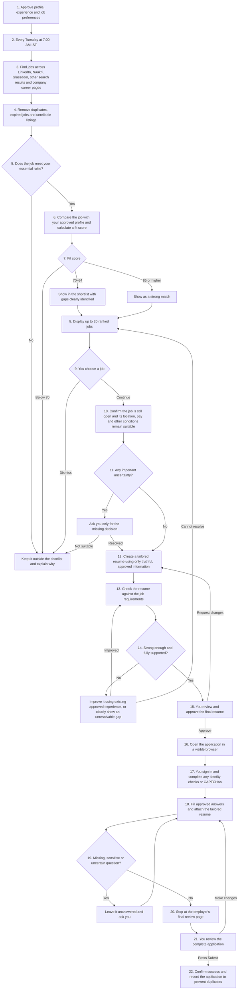

# Job Search Cockpit — Approved User-Flow Baseline

**Approved by:** Varun Nanduri

**Approved on:** 4 September 2026
**Status:** Baseline for requirements, implementation, and acceptance reviews

## Completion rule

Each numbered step remains `Not built`, `Partly complete`, or `Complete` until
its agreed outcome is demonstrated. Supporting code alone does not make a step
complete. The product must provide the user-visible result and pass the
relevant acceptance check.

The system must never press the employer's final **Submit** button. It prepares
and fills the application, stops at the employer's final review page, and waits
for Varun to review and submit it.

## Approved flow

## Agreed operating decisions

- Search runs automatically every Tuesday at 7:00 AM India time.
- Sources cover LinkedIn, Naukri, Glassdoor, broader job-search results, and
  company career pages.
- The system presents a ranked shortlist before preparing a resume.
- Varun chooses which job continues to resume and application preparation.
- Only approved, truthful profile information may be used.
- Missing, sensitive, uncertain, sign-in, one-time-code, and CAPTCHA steps
  remain with Varun.
- The system fills the application and attaches the correct resume but stops
  before final submission.
- After Varun submits, the system records confirmed success to prevent
  duplicate applications.

## Baseline change control

Every delivery must reference the affected step numbers and provide evidence
for any status change. Changing this flow requires Varun's explicit approval;
implementation work alone cannot silently change the baseline.
